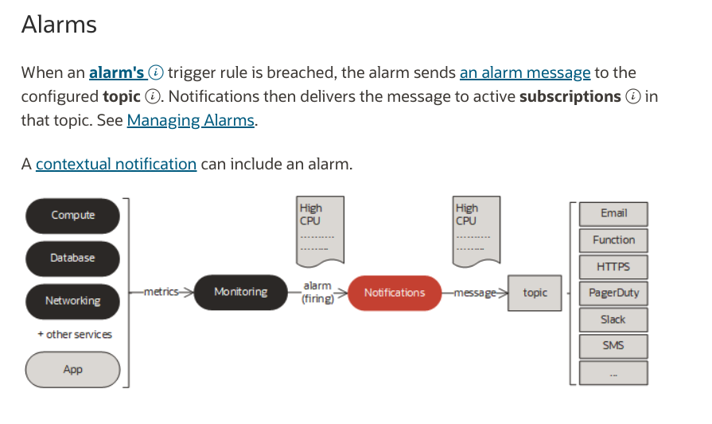

# Exporting OCI Notifications to Netcool

---

## Overview

This sample OCI Function maps OCI Notifications to [IBM® Tivoli® Netcool/OMNIbus Probe](https://www.ibm.com/docs/en/SSSHTQ_int/pdf/messbuspr-pdf.pdf). 

Here is the [basic pattern](https://docs.oracle.com/en-us/iaas/Content/Notification/Concepts/notificationoverview.htm):

### Prerequisites

If you’re new to Functions, get familiar by running through 
the [Quick Start guide on OCI Functions](http://docs.oracle.com/en-us/iaas/Content/Functions/Tasks/functionsquickstartguidestop.htm) before proceeding.

---
## Notifications Service
The [Notifications Service](https://docs.oracle.com/en-us/iaas/Content/Notification/Concepts/notificationoverview.htm) 
details are found here.  You will need to set up a Topic and a Subscription.  The
Subscription we need will target the Function we are building.  During testing, you may find it useful to have an 
Email Subscription to see what the Notification system is receiving / sending.  

---
## Monitoring Service

The [Monitoring Service](https://docs.oracle.com/en-us/iaas/Content/Monitoring/Concepts/monitoringoverview.htm) details
can be found here.  You will need to set up an Alarm that connects to your Notification Topic.

---
## Functions Service

I need to transform between the raw notification formats and some way to make the API calls. The 
[OCI Functions Service](http://docs.oracle.com/en-us/iaas/Content/Functions/Concepts/functionsoverview.htm) is a 
natural fit for the task. Functions integrate nicely with Notifications a target.

---
## Mapping From OCI to Netcool Formats

A key requirement of course is the mapping of OCI to Netcool format.  Let's compare the OCI and Netcool
message payload formats, what the mapping needs to accomplish, and see what the resulting transformed message 
looks like.

Example OCI Notifications Payload:
    
     {
       "dedupeKey": "3d5c2f16-....",
       "title": "ontario-health-alarm",
       "body": "ontario-health test alarm",
       "type": "OK_TO_FIRING",
       "severity": "INFO",
       "timestampEpochMillis": 1680821220000,
       "timestamp": "2023-04-06T22:47:00Z",
       "alarmMetaData": [
         {
           "id": "ocid1.alarm.oc1.phx.....",
           "status": "FIRING",
           "severity": "INFO",
           "namespace": "oci_objectstorage",
           "query": "AllRequests[1m]{resourceDisplayName = \"ontario-health-bucket\"}.count() > 1",
           "totalMetricsFiring": 1,
           "dimensions": [
             {
               "resourceID": "ocid1.bucket.oc1.phx.....",
               "resourceDisplayName": "ontario-health-bucket"
             }
           ],
           "alarmUrl": "https://cloud.oracle.com/monitoring/alarms/ocid1.alarm.oc1.phx..."
         }
       ],
       "version": 1.3
     }

Example Netcool Payload:

     {
       "receiver": "Sandbox - Info",
       "status": "firing",
       "alerts": [
         {
           "status": "firing",
           "labels": {
             "alertname": "UpdateAvailable",
             "channel": "eus-4.10",
             "openshift_io_alert_source": "platform",
             "prometheus": "openshift-monitoring/k8s",
             "severity": "info",
             "upstream": "\u003cdefault\u003e"
           },
           "annotations": {
             "description": "For more information refer to ...",
             "summary": "Your upstream update recommendation service recommends you update your cluster."
           }
         }
       ]
     }

Mapping Behavior:

     TBD

Resulting Output:

     TBD

---
## Policy Setup

You will need to authorize the Notifications Service to invoke your Function.

    Allow service notification to use fn-app in compartment {compartment name}

---
## Function Environment

Here are the supported Function parameters:

| Environment Variable | Default           | Purpose                                                                               |
|----------------------|:-------------:|:--------------------------------------------------------------------------------------|
| API_ENDPOINT         | not-configured | REST API endpoint                                                                     |
| API_KEY              | not-configured      | API license token                                                                     |
| LOGGING_LEVEL        | INFO     | Controls function logging outputs.  Choices: INFO, WARN, CRITICAL, ERROR, DEBUG       |
| FORWARD_TO_ENDPOINT  | True      | Determines whether messages are forwarded to the API endpoint (useful during testing) |

---
## **OCI** Related Workshops

LiveLabs is the place to explore Oracle's products and services using workshops designed to 
enhance your experience building and deploying applications on the Cloud and On-Premises.
ur library of workshops cover everything from how to provision the world's first autonomous 
database to setting up a webserver on our world class OCI Generation 2 infrastructure, 
machine learning and much more.  Use your existing Oracle Cloud account, 
a [Free Tier](https://www.oracle.com/cloud/free/) account or a LiveLabs Cloud Account to build, test, 
and deploy applications on Oracle's Cloud.

Visit [LiveLabs](http://bit.ly/golivelabs) now to get started.  Workshops are added weekly, please visit frequently for new content.

---
## License
Copyright (c) 2023, Oracle and/or its affiliates. All rights reserved.
Licensed under the Universal Permissive License v 1.0 as shown at https://oss.oracle.com/licenses/upl.
