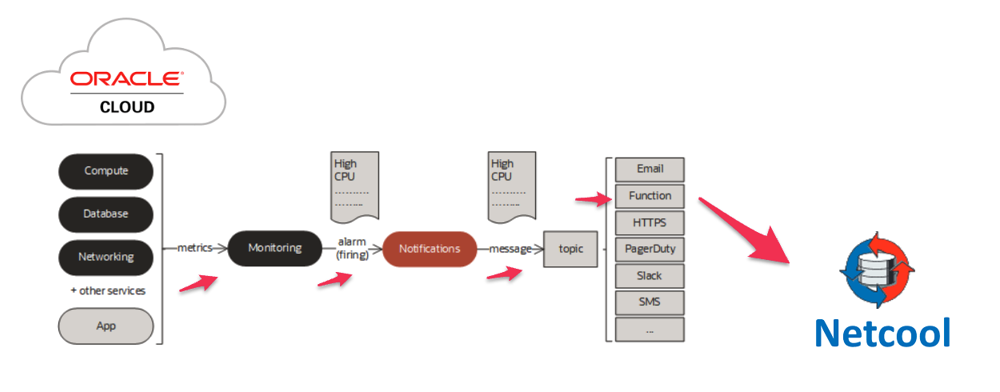

# Exporting OCI Notifications to Netcool

---

## Overview

This solution sample 
uses [OCI Notifications](https://docs.oracle.com/en-us/iaas/Content/Notification/home.htm) 
to export [OCI Alarms](https://docs.oracle.com/en-us/iaas/Content/Monitoring/Concepts/monitoringoverview.htm) 
to [IBM® Tivoli® Netcool/OMNIbus Probe](https://www.ibm.com/docs/en/SSSHTQ_int/pdf/messbuspr-pdf.pdf). 

---
## Notifications Service
The [Notifications Service](https://docs.oracle.com/en-us/iaas/Content/Notification/Concepts/notificationoverview.htm) 
supports several 
[Integration Patterns](https://docs.oracle.com/en-us/iaas/Content/Notification/Concepts/notificationoverview.htm#Flow__alarms).  We will be using the Alarms-to-Notifications pattern for this NetCool use case.
You will need to set up a Notification Topic that targets the Function we will build.  

### Monitoring Alarm Integration

Here's the basic architecture:

---
## Monitoring Service

The [Monitoring Service](https://docs.oracle.com/en-us/iaas/Content/Monitoring/Concepts/monitoringoverview.htm) can
monitor resources and emit Alarms when a resource breaches a prescribed operating threshold.  We will set up an Alarm that connects to your Notification Topic.

---
## Functions Service

The [OCI Functions](http://docs.oracle.com/en-us/iaas/Content/Functions/Concepts/functionsoverview.htm) is 
based on the [Fn Project](https://fnproject.io/), an open source, container 
native, serverless platform that can be run anywhere - any cloud or on-premises. Fn Project 
is easy to use, extensible, and performant.

---
## OCI Notifications Format

Because Notifications is a general service, it can handle different types of message formats.  This
sample implementation simply forwards the Notification JSON as-is to NetCool. 

Here is a sample JSON payload for reference.  In this example, we have a firing `Alarm` from the `oci_objectstorage` namespace.

     {
       "dedupeKey": "3d5c2f16-....",
       "title": "example-alarm",
       "body": "example test alarm",
       "type": "OK_TO_FIRING",
       "severity": "INFO",
       "timestampEpochMillis": 1680821220000,
       "timestamp": "2023-04-06T22:47:00Z",
       "alarmMetaData": [
         {
           "id": "ocid1.alarm.oc1.phx.....",
           "status": "FIRING",
           "severity": "INFO",
           "namespace": "oci_objectstorage",
           "query": "AllRequests[1m]{resourceDisplayName = \"example-bucket\"}.count() > 1",
           "totalMetricsFiring": 1,
           "dimensions": [
             {
               "resourceID": "ocid1.bucket.oc1.phx.....",
               "resourceDisplayName": "example-bucket"
             }
           ],
           "alarmUrl": "https://cloud.oracle.com/monitoring/alarms/ocid1.alarm.oc1.phx..."
         }
       ],
       "version": 1.3
     }

---
# Setting up the Function App in OCI

Here are the steps to deploying this in your OCI tenancy.

## Compartment

Create a compartment to contain the following:

- Virtual Cloud Network
- Application + Function
- Service Connector

_Let's assume you create a compartment with name `ABC`._

## Group

Create a user group where we can assign developer related policies.   

_Let's assume you create a user group with name `functions-developers`._

## Policies

See [common policies](https://docs.oracle.com/en-us/iaas/Content/Identity/Concepts/commonpolicies.htm).

Here is an example IAM policy structure:

Allow users in `functions-developers` to create, deploy and manage Functions and Applications at the tenancy level.

    Allow group functions-developers to manage repos in tenancy
    Allow group functions-developers to manage metrics in tenancy
    Allow group functions-developers to manage notifications in tenancy
    Allow group functions-developers to use cloud-shell in tenancy
    Allow group functions-developers to use virtual-network-family in tenancy

Allow Functions Service to use OCIR Repositories at the tenancy level:

    Allow service faas to use repos in tenancy 

---
## Build the Function

Follow the steps found in the [Quick Start guide on OCI Functions](http://docs.oracle.com/en-us/iaas/Content/Functions/Tasks/functionsquickstartguidestop.htm).
The [Cloud Shell instructions](https://docs.oracle.com/en-us/iaas/Content/Functions/Tasks/functionsquickstartcloudshell.htm#functionsquickstart_cloudshell) are recommended.

### Function Configuration

Here are the supported Function parameters:

| Environment Variable | Default           | Purpose                                                                               |
|----------------------|:-------------:|:--------------------------------------------------------------------------------------|
| API_ENDPOINT         | not-configured | REST API endpoint                                                                     |
| API_KEY              | not-configured      | API license token                                                                     |
| LOGGING_LEVEL        | INFO     | Controls function logging outputs.  Choices: INFO, WARN, CRITICAL, ERROR, DEBUG       |
| FORWARD_TO_ENDPOINT  | True      | Determines whether messages are forwarded to the API endpoint (useful during testing) |

---
## Troubleshooting

This [troubleshooting guide](https://docs.public.oneportal.content.oci.oraclecloud.com/en-us/iaas/Content/Functions/Tasks/functionstroubleshooting.htm) can also be very helpful.
[Enable Function Invocation Service logs](https://docs.oracle.com/en-us/iaas/Content/Functions/Tasks/functionsexportingfunctionlogfiles.htm) to see the logs generated by the Function.
It's a good idea to set `LOGGING_LEVEL = DEBUG` as a general rule while first deploying the Function.  

### Function Timing-Out

* Increase `BATCH_SIZE` to a larger value
* Set `LOGGING_LEVEL = INFO`
* [Increase Function timeout and / or memory allocation](https://docs.oracle.com/en-us/iaas/Content/Functions/Tasks/functionscustomizing.htm)

---
## Conclusion

You now have a low-maintenance, serverless function that forwards OCI Notifications to NetCool in
near-real time.

---
## **OCI** Related Workshops

LiveLabs is the place to explore Oracle's products and services using workshops designed to 
enhance your experience building and deploying applications on the Cloud and On-Premises.
ur library of workshops cover everything from how to provision the world's first autonomous 
database to setting up a webserver on our world class OCI Generation 2 infrastructure, 
machine learning and much more.  Use your existing Oracle Cloud account, 
a [Free Tier](https://www.oracle.com/cloud/free/) account or a LiveLabs Cloud Account to build, test, 
and deploy applications on Oracle's Cloud.

Visit [LiveLabs](http://bit.ly/golivelabs) now to get started.  Workshops are added weekly, please visit frequently for new content.

---
## License
Copyright (c) 2023, Oracle and/or its affiliates. All rights reserved.
Licensed under the Universal Permissive License v 1.0 as shown at https://oss.oracle.com/licenses/upl.
